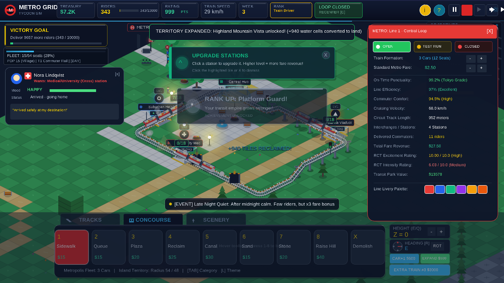
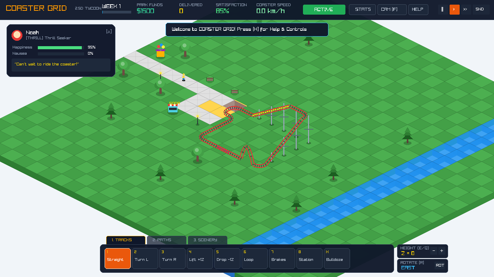

# METRO GRID
> A 2.5D isometric urban transit simulator — design a living metro network, run the OCC dispatch desk, and triage commuter overcrowding in real time.

**Cognition GameJam '26 submission.** Built in C++17 with [Raylib 6.0](https://www.raylib.com/). All audio is 100% procedurally synthesized in code — no external assets exist.

---

## 📸 In-Game Screenshots

| OCC Dispatcher Dashboard | Metro Hub & Island Platform |
|---|---|
|  |  |

| Viaduct Signalling | Night Lighting |
|---|---|
|  |  |

| Crew Management | Commuter Inspector |
|---|---|
|  |  |

More captures in `raylib/*.png` (`test_*.png`, `gameplay_*.png`).

---

## 🎮 What Is It?

A real-time metro/subway network design and commuter queue triage simulator. You lay elevated viaducts, tunnels, stations and depots across a dimetric isometric city, then keep the network alive as thousands of commuters flood in. It combines the creative infrastructure construction of **RollerCoaster Tycoon** with the crowd logistics pressure of **Mini Metro**, wrapped in a full Operations Control Centre (OCC) dispatcher layer.

### Core Features

- **2.5D isometric engine**: dimetric 64×32 tiles, elevation Z0–Z5, depth cliff faces, steel trellis pillars.
- **Dual-rail track engine**: straights, curves, elevated viaducts, tunnel portals, stations with island platforms and turnstile concourse plazas.
- **3-aspect live signalling**: green / yellow / red block control so trains never collide on shared track.
- **EMU rolling stock**: acceleration & braking profiles, door animation, day / night headlamps.
- **Commuter AI**: Worker / Student / Tourist / Executive archetypes with origin–destination flows and dynamic thought bubbles.
- **Station overcrowding triage**: a circular dispatch clock appears when queues exceed capacity; if it expires, riders walk out and satisfaction drops 15%.
- **Transit crew management**: hire drivers and station staff, manage cleanliness and infrastructure inspection.
- **Economy & progression**: weekly revenue cycle, treasury, service milestones, line opening ceremonies.
- **Procedural audio**: VVVF inverter motor sounds, door chimes, crowd ambience, dispatch bells — all synthesized at runtime.
- **Day / sunset / night cycle** with lamppost and headlamp lighting.

---

## ⌨️ Controls Cheat Sheet

| Key / Control | Action |
|---|---|
| **W / A / S / D** or **Arrow Keys** | Pan camera |
| **Right Mouse Drag** | Pan camera |
| **Mouse Wheel** | Zoom in / out |
| **Left Mouse Click** | Place piece / inspect commuter / click UI |
| **TAB** | Cycle build categories |
| **1 – 8** | Select tool in active category |
| **X** | Bulldozer toggle |
| **R** | Rotate piece (N / E / S / W) |
| **E / Q** | Raise / lower elevation (Z ∈ [0, 5]) |
| **Space** | Pause / resume |
| **M** | Mute |
| **C** | Recover derailed train |
| **F** | Ride camera (lock on train) |
| **T** | Stats window |
| **P** | Crew / staff window |
| **H** | Help overlay |

---

## 🛠️ Build & Run

The playable game lives in the [`raylib/`](raylib/) directory.

### Prerequisites

- `g++` with C++17 support
- **Raylib 4.0+** (`pkg-config --libs raylib` must resolve)

### Make (primary)

```bash
cd raylib
make          # builds metro_grid, symlinks coaster_grid
./coaster_grid
```

### CMake (alternative)

```bash
cd raylib
mkdir build && cd build
cmake ..
make
./coaster_grid
```

### Self-contained build (no raylib dependency)

For distribution, the game can be statically linked against a locally built `libraylib.a`:

```bash
# Build static raylib (from ~/raylib-src, version 6.0)
cmake -S raylib-src -B raylib-src/build_static -DCMAKE_BUILD_TYPE=Release -DBUILD_SHARED_LIBS=OFF -DBUILD_EXAMPLES=OFF
make -C raylib-src/build_static -j$(nproc)

# Link the game against it
cd raylib
g++ -O2 -std=c++17 -Isrc src/*.cpp -o metro_grid_static \
    <raylib-src>/build_static/raylib/libraylib.a \
    -lGL -lm -lpthread -ldl -lrt -lX11 -lXrandr -lXinerama -lXcursor -lXi
```

Requires a Linux x86_64 desktop with OpenGL 3.3.

---

## 📁 Repository Layout

```
game/      # Early Godot 4.7 scaffold (abandoned experiment)
raylib/    # Active C++17 + Raylib codebase (~4,800 LOC)
├── src/
│   ├── main.cpp        # Entry point
│   ├── common.hpp      # Shared constants, types, enums
│   ├── game.hpp/cpp    # Core Game class, state, loop
│   ├── isometric.hpp/cpp # 2.5D projection engine
│   ├── track.hpp/cpp   # Track, signalling, stations
│   ├── train.hpp/cpp   # EMU physics & animation
│   ├── peep.hpp/cpp    # Commuter AI & management
│   ├── ui.hpp/cpp      # HUD, windows, overlays
│   ├── audio.hpp/cpp   # Procedural audio synthesizer
│   └── particles.hpp/cpp # Particle effects
├── test_capture.cpp    # Screenshot test harness (generates *.png)
├── Makefile            # GNU Make build
├── CMakeLists.txt      # CMake build
└── README.md           # Detailed game documentation
```

---

## 🚌 Game Jam Submission

The packaged build for Devfolio lives in [`build/`](build/):

- `MetroGrid_GameJam26.zip` — self-contained game + screenshots + `README.txt`
- `MetroGrid_README.ms` / `MetroGrid_README.pdf` — submission README source & PDF

Built in focused loops, one complete game layer each: procedural audio synth → track & signalling engine → isometric art direction → EMU rolling stock → commuter AI → queue triage → OCC dispatcher & crew UI.

---

## 📜 License & Credits

- Built for **Cognition GameJam '26** (Navi Mumbai, Sep 2026).
- Powered by Raylib (zlib-style license).