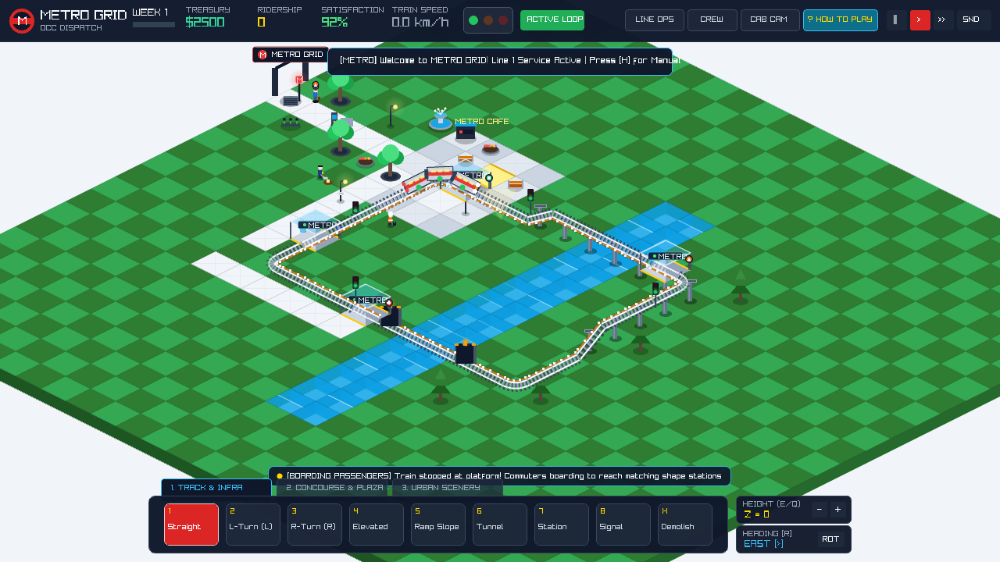
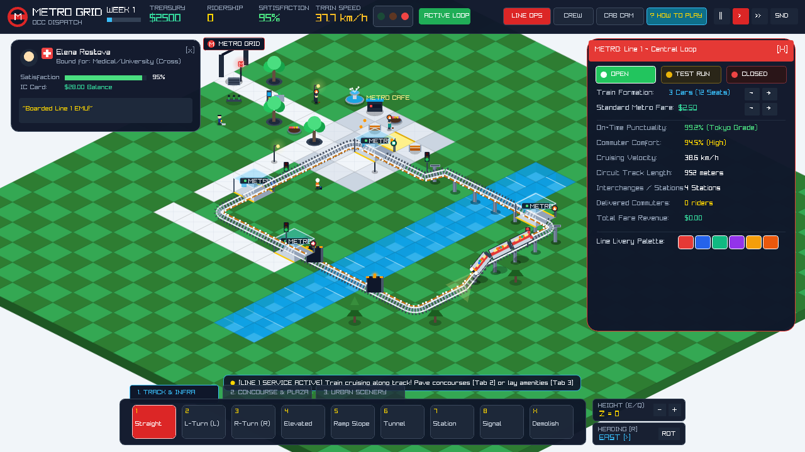
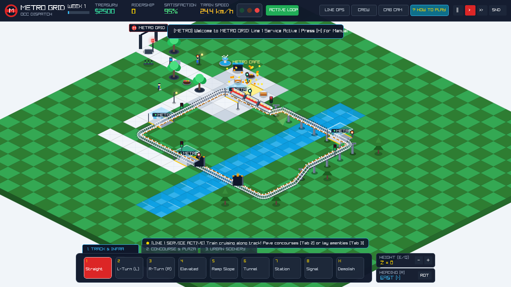
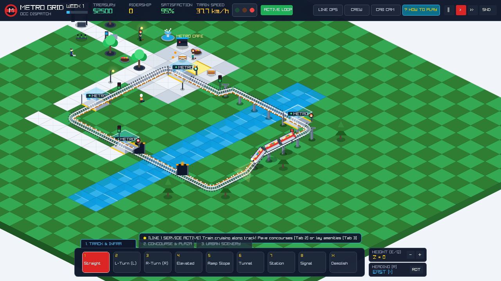
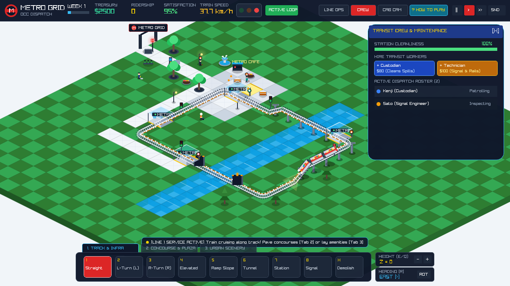
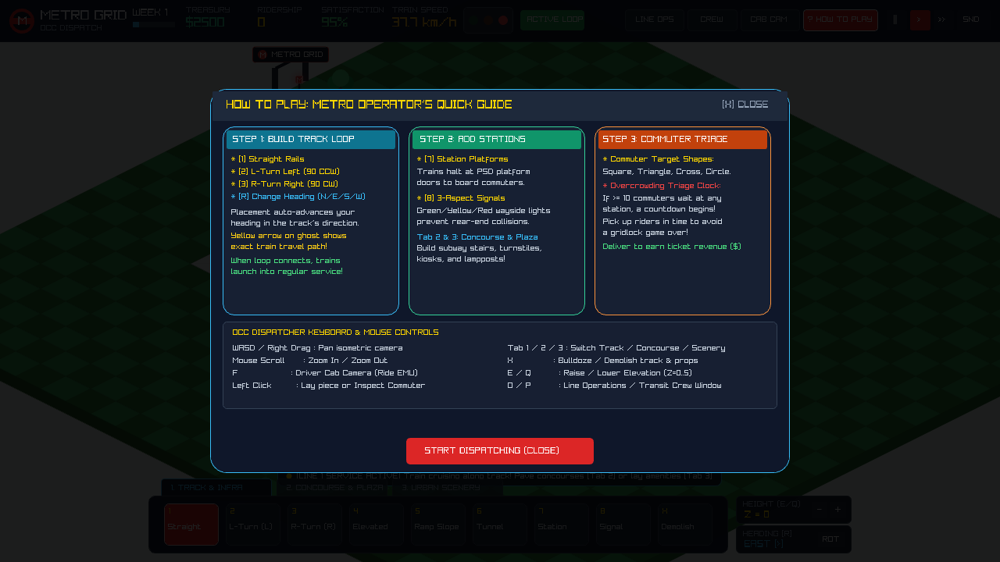

# METRO GRID: 2.5D Isometric Metro Tycoon
> A real-time metropolitan transit network design & crowd triage simulator combining the creative construction, operating modes, and management depth of **RollerCoaster Tycoon** with the elegant urban network flow and shape-based passenger triage of **Mini Metro**. Built in C++17 using **Raylib 6.0**.

---

## 📸 In-Game Screenshots

| Central Hub Island Platform & Fountain | Operations Control Center (OCC) Dashboard |
|---|---|
|  |  |

| Passenger Boarding & Fare Collection | Elevated SkyTrain Viaduct & Canal |
|---|---|
|  |  |

| Transit Crew & Platform Maintenance | OCC Operations Quick Guide |
|---|---|
|  |  |

---

## 🎮 Complete Feature Set

### 1. RollerCoaster Tycoon Inspired Mechanics
- **3-Aspect Line Operating Modes**:
  - 🟢 **OPEN**: Full passenger service active. Commuters queue, board, and pay fares upon delivery.
  - 🟡 **TEST RUN**: Train operates continuous test loops without taking passengers—ideal for verifying custom circuits, viaduct grades, and track alignment before opening to the public.
  - 🔴 **CLOSED**: Service suspended. Train comes to a safe stop at the platform.
- **Rolling Stock Fleet Formation**:
  - Dynamically configure trainsets between **2, 3, 4, or 5 EMU cars** (8 to 20 passenger capacity) with responsive handling physics.
- **Ticket Fare Tariff Control**:
  - Adjust network ticket pricing from **$0.50 to $10.00** using responsive `[-]` / `[+]` stepping controls.
- **Floating Financial Feedback**:
  - Every transaction is visually signaled directly on the isometric map using RCT-style floating drop-shadowed text: `+$2.50` fare earnings in emerald green, `-$40` rail construction in bright crimson, and refund credits.
- **Commuter / Guest Inspector Card**:
  - Click on any passenger on the concourse, queue line, or inside a train car to view their profile, target station shape, transit smartcard balance, satisfaction rating, and live thoughts.

### 2. Kinetic Train Physics & Infinite Circuit Simulation
- **Continuous Loop Reliability**:
  - Trains navigate arbitrary closed loops and multi-station circuits indefinitely without stalls, derailments, or ghost passenger traps.
- **Realistic Station Deceleration & Dwell Profile**:
  - Lookahead circuit distance calculation detects upcoming station platforms and calculates an exact deceleration curve from 70 km/h down to 0 km/h.
  - Halts dead-center at platform screen doors (PSDs).
  - Procedural door opening chime (`SFX_DOOR_OPEN`), followed by passenger alighting, fare collection, commuter boarding, dwell countdown, and door closing chime (`SFX_DOOR_CLOSE`).
- **Dynamic Wayside Signaling**:
  - 3-aspect trackside signals (Green $\rightarrow$ Yellow $\rightarrow$ Red) automatically monitor block occupancy and enforce safe train separation.

### 3. 2.5D Isometric Construction Engine
- **Classic Dimetric Projection**: $64 \times 32$ diamond tiles with multi-level elevation ($Z \in [0, 5]$), viaduct support pillars, and canal water bodies.
- **Categorized Construction Dock**:
  - **Category 1: Track & Signaling**:
    - `[1] Straight Track`: High-speed continuous rail.
    - `[2] L-Turn Left` & `[3] R-Turn Right`: 90-degree curved rail transitions.
    - `[4] Elevated Viaduct`: Concrete elevated guideway (+1Z).
    - `[5] Ramp Slope`: Smooth elevation transition between grades (-1Z).
    - `[6] Tunnel Portal`: Subterranean portal entry for underground lines.
    - `[7] Station Platform`: Island platform with tactile pavers, PSDs, PIDS, and station totem.
    - `[8] 3-Aspect Signal`: Wayside signal mast for automatic train control.
    - `[X] Bulldozer`: Demolish and recover funds (+$25 rail refund).
  - **Category 2: Concourse & Infrastructure**:
    - `[1] Sidewalk`: Granite pavement for commuter foot traffic.
    - `[2] Tactile Queue`: Platform queuing lanes with safety markings.
    - `[3] Plaza Stone`: Expansive architectural transit plazas.
  - **Category 3: Urban Scenery & Amenities**:
    - `[1] Subway Entrance`: Grand neoclassical portal arch with glowing roundel marquee.
    - `[2] Fare Gates`: Contactless smartcard turnstiles and TVM ticketing machines.
    - `[3] Oak Tree`: Leafy municipal shade trees.
    - `[4] Pine Tree`: Conifer park landscaping.
    - `[5] Bench`: Modern stainless steel and wood platform seating.
    - `[6] LED Lamp Post`: High-efficiency streetlamps illuminating platforms at night.
    - `[7] Fountain`: Multi-jet splashing water fountain with animated water sprays.
    - `[8] Metro Cafe`: Refreshment kiosk providing coffee and snacks.

### 4. Transit Crew & Station Maintenance
- **Station Custodians (Blue Uniform & Broom)**:
  - Patrol concourses and platforms, automatically locating and cleaning spilled coffee and litter to keep station cleanliness at 100%.
- **Signal Engineers (High-Vis Orange & Hardhat)**:
  - Inspect switches, 3rd rail power feeds, and wayside signaling masts.
- **Transit Crew Management Window (`P` or `[CREW]`)**:
  - Real-time cleanliness gauge, one-click hiring (`+ Custodian $80`, `+ Technician $100`), and live patrol roster.

### 5. Mini Metro Commuter Triage
- **Commuter Target Shapes**:
  - Commuters carry destination symbols: ⬛ **Square** (Central Hub), 🔺 **Triangle** (Marina Viaduct), ➕ **Cross** (University Med Center), and ⭕ **Circle** (Suburban Terminal).
- **Overcrowding Triage Alarm**:
  - Stations with excessive passenger backlog display an overcrowding warning timer. Clear waiting crowds with timely dispatches before commuters walk out in frustration!

### 6. Procedural Audio Synthesizer (`src/audio.cpp`)
- 100% synthesized procedural audio with zero external audio assets:
  - EMU electric motor acceleration/deceleration whine
  - Dual-tone door open chime (High-Mid chime)
  - Quad-tone door closing warning (Tokyo Metro melody)
  - Metallic double-bell cash register chime (`SFX_CASH_REGISTER`)
  - Smartcard turnstile tap beep
  - Platform dispatch chime
  - Construction hammer & rubble bulldozing sounds
  - Overcrowding triage alarm bell

---

## ⌨️ Controls Cheat Sheet

| Key / Control | Action |
|---|---|
| **W / A / S / D** or **Arrow Keys** | Pan isometric camera |
| **Right Mouse Drag** | Pan camera smoothly |
| **Mouse Wheel** | Zoom In / Zoom Out |
| **Left Mouse Click** | Place piece / Inspect commuter / Click UI buttons |
| **TAB** | Switch category (1. Track / 2. Concourse / 3. Scenery) |
| **1 - 8** | Select tool in active category |
| **X** | Toggle Bulldozer (refunds cost) |
| **R** | Rotate build heading (North, East, South, West) |
| **E / Q** | Raise / Lower placement elevation ($Z \in [0, 5]$) |
| **F** | Toggle Driver's Cab Cam (lock camera to lead EMU) |
| **T** | Toggle Line Operations Window (Mode, Fleet size, Fare tariff, Livery) |
| **P** | Toggle Transit Crew Window (Cleanliness, Staff hiring) |
| **H** or **?** | Toggle Operations Manual & Tutorial Overlay |
| **C** | Calibrate / Reset train position to Central Hub |
| **Space** | Pause / Resume simulation |
| **M** | Toggle audio mute |

---

## 🛠️ Build & Run

### Linux / macOS
```bash
cd raylib
make clean && make
./metro_grid
```

### Windows (MSYS2 / MinGW)
```bash
make
./metro_grid.exe
```
