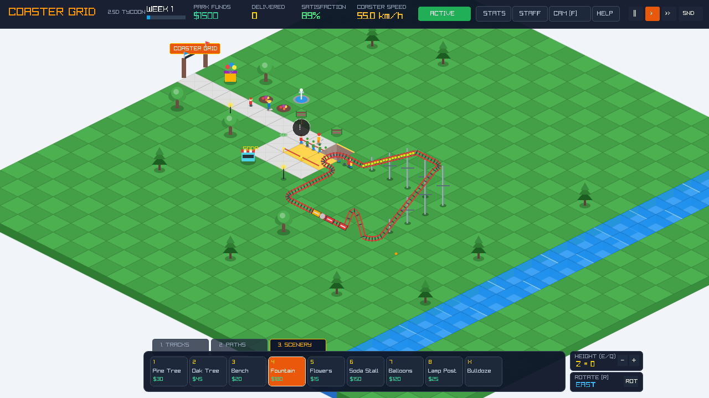
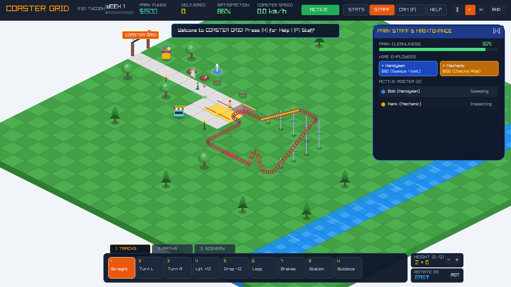
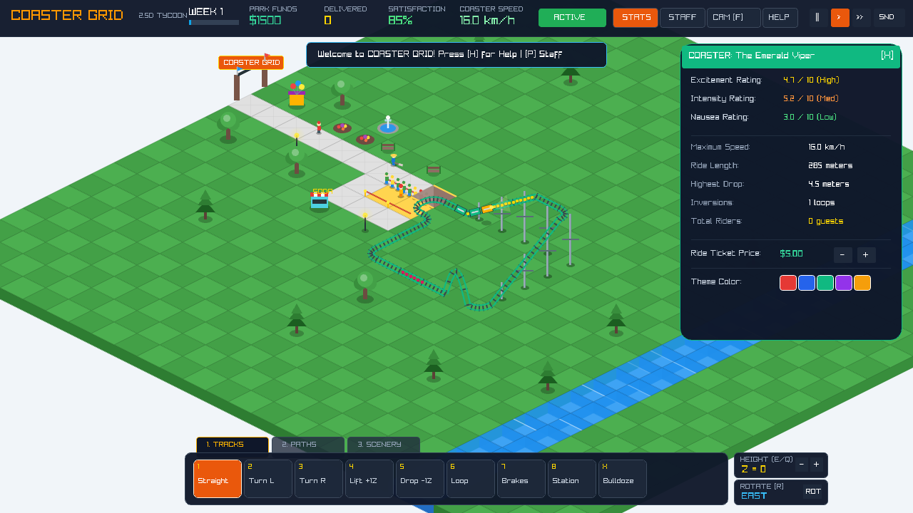
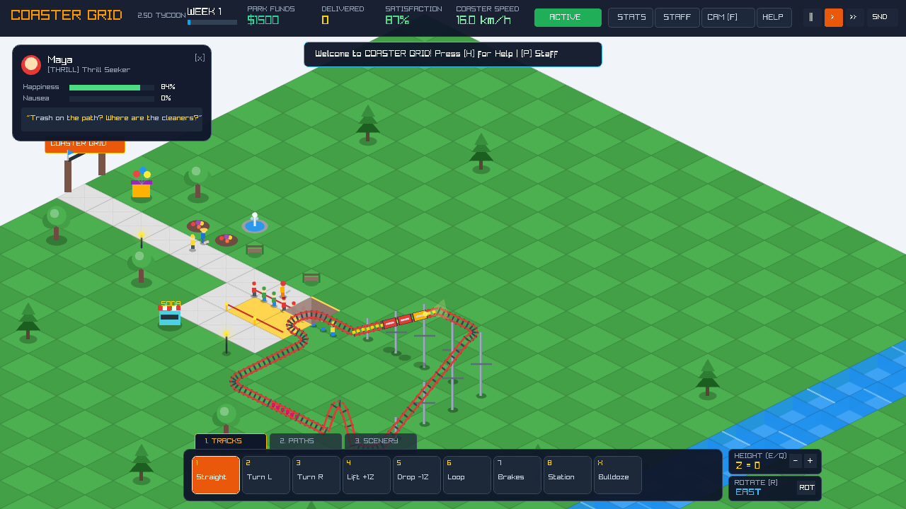
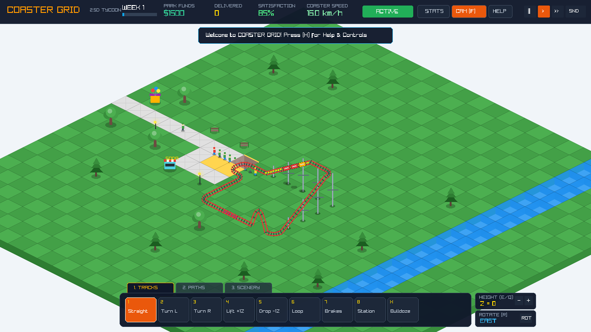

# COASTER GRID: 2.5D Isometric Coaster Tycoon
> A real-time coaster design & queue triage simulator combining the creative track construction and kinetic physics of **RollerCoaster Tycoon** with the high-stakes crowd logistics and station overcrowding mechanics of **Mini Metro**. Built in C++ using **Raylib**.

---

## 📸 In-Game Screenshots

| Park Entrance Plaza & Staff Sweeping | Staff & Cleanliness Management Window |
|---|---|
|  |  |

| Night Rush Hour & Lamppost Lighting | Custom Coaster Paint (Emerald Viper) |
|---|---|
|  |  |

| Guest Inspector & Helium Balloons | Ride Cam Action (Following Train) |
|---|---|
|  |  |

---

## 🎮 Complete Feature Set

### 1. 2.5D Isometric Construction Engine
- **Classic Dimetric Projection**: 2:1 ratio ($64 \times 32$ diamond tiles) with elevation levels ($Z \in [0, 5]$), depth cliff faces, and steel support trellis pillars.
- **Grand Park Entrance Arch**: Imposing brick archway with welcome flags and entrance sign at `(0, 12)`.
- **Categorized Building Dock**:
  - **Category 1: Track Pieces**:
    - `[1] Straight Track`: High-speed flat line.
    - `[2] Turn Left` & `[3] Turn Right`: 90-degree curved track sections.
    - `[4] Chain Lift Hill (+1Z)`: Motorized ratchet ascent with procedural gear clicks.
    - `[5] Steep Drop (-1Z)`: Gravity plunge converting potential into kinetic velocity.
    - `[6] Vertical Inversion Loop`: Stunt element that Thrill Seekers love.
    - `[7] Magnetic Brakes`: Deceleration zone before sharp turns or station.
    - `[8] Station Platform`: Boarding & arrival terminal.
    - `[X] Bulldozer`: Demolish and refund track, paths, or scenery.
  - **Category 2: Paths & Infrastructure**:
    - `[1] Cobblestone Footpath`: Pave park promenades for arriving guests.
    - `[2] Queue Line`: Designated queue tiles with polished brass stanchions & red velvet ropes.
    - `[X] Bulldozer`: Revert path to grass.
  - **Category 3: Scenery & Landscaping**:
    - `[1] Pine Tree` ($30): Dense evergreens boosting park satisfaction.
    - `[2] Oak Tree` ($45): Lush leafy shade trees.
    - `[3] Park Bench` ($20): Resting spot that reduces guest nausea!
    - `[4] Splashing Fountain` ($180): Elegant multi-tier water fountain with animated splashes.
    - `[5] Flower Bed` ($15): Vibrant multi-color botanical blossoms.
    - `[6] Soda Stall` ($150): Generates +$2.50 per drink and cures queasy guests!
    - `[7] Balloon Stall` ($120): Sells floating helium balloons that guests carry around the park.
    - `[8] Victorian Lamp Post` ($25): Evening illumination casting radiant warm light pools.
    - `[X] Bulldozer`: Clear scenery.

### 2. Staff Management & Park Cleanliness
- **Handymen (Blue Overalls & Straw Hat)**:
  - Patrol walkways with sweeping brooms.
  - Detect and sweep away vomit puddles and empty soda cups.
  - Keep Park Cleanliness high to prevent guest dissatisfaction!
- **Mechanics (Orange/Yellow Jumpsuit & Hardhat)**:
  - Patrol station and track junctions with wrenches to inspect ride reliability.
- **Staff Management Window (`P` or `[STAFF]`)**:
  - Live Park Cleanliness percentage gauge.
  - One-click employee hiring (`+ Handyman $80`, `+ Mechanic $100`).
  - Active staff roster with real-time status indicators ("Sweeping", "Inspecting", "Patrolling").

### 3. Comprehensive Theme Park UI & UX
- **Top HUD**:
  - In-game calendar week counter & progression bar.
  - Live park treasury (`PARK FUNDS: $1,500`).
  - Delivered guests score & Park Satisfaction percentage rating.
  - Coaster speedometer (`km/h`) with color-coded safety warnings.
  - Circuit status pill (`ACTIVE` in green, `CIRCUIT OPEN` in red).
  - Quick action buttons: `[STATS]`, `[STAFF]`, `[CAM (F)]`, `[HELP]`, `[|| / > / >>]`, `[SND / MUT]`.
- **Coaster Information Window (`T` or `[STATS]`)**:
  - Comprehensive RCT ratings: **Excitement**, **Intensity**, and **Nausea**.
  - Technical telemetry: Max Speed, Track Length, Highest Drop, Inversions, Total Riders.
  - **Coaster Line Palette Theme**: Instantly repaint rails and carriages to **Red Falcon**, **Blue Comet**, **Emerald Viper**, **Mystic Phantom**, or **Golden Dragon**!
  - **Real-Time Ticket Pricing**: Adjust ticket price with `[-]` and `[+]` buttons ($1.00 to $20.00).
- **Guest Inspector Card**:
  - Click on any peep in the park or queue line to open their personal inspector card:
    - Guest portrait, name, and archetype badge.
    - Happiness percentage bar & Nausea percentage bar.
    - Dynamic thought bubble reacting to rides, cleanliness, benches, and stalls.
- **Ride Camera Mode (`F` or `[CAM]`)**:
  - Locks the camera onto the train, smoothly tracking its journey around the circuit with speed-dependent camera shake on high-velocity drops!
- **Day / Sunset / Night Cycle**:
  - Cycles with the weekly progression: crisp daytime $\rightarrow$ golden sunset $\rightarrow$ atmospheric twilight night with radial lamppost light pools and train headlamps!
- **Toast Notification Banner**:
  - Slides down with high-priority updates (e.g. circuit closure, queue backups, derailments, milestones).
- **Interactive Help Overlay (`H` or `?`)**:
  - Full keyboard & mouse guide accessible at any time.

### 4. Kinetic Coaster Physics & Safety Limits
- **Energy Conservation**: $E_p + E_k = \text{Const} - \text{Friction}$. Gravity drives acceleration down steep slopes; friction and brake runs decelerate the train safely.
- **Dangerous Speed Derailment**: Entering sharp turns above safe speed limits (>75 km/h) derails the train into tumbling crash cars with sparks and smoke! Press `C` to recover the train to the station.

### 5. Mini Metro Queue Triage Logistics
- **Peep Archetypes**:
  - 🔴 **Thrill Seekers**: Demand loops and steep drops; boost Park Satisfaction rating.
  - 🟢 **Casuals**: Enjoy smooth, balanced rides.
  - 🟡 **Queasy Peeps**: High sensitivity to nausea; may vomit if ride is too intense.
- **Station Overcrowding Countdown**:
  - If queue line backs up to $\ge 10$ guests, a circular **Mini Metro Triage Clock** appears over the station.
  - If the train is not dispatched quickly enough to clear the line before the clock expires, guests riot and walk out, dropping Park Satisfaction by 15%!

### 6. Procedural Audio Synthesizer (`audio.cpp`)
- 100% self-contained waveform generator in memory (no external `.wav` / `.ogg` files):
  - Chain lift motorized gear clicks
  - Aerodynamic wind whoosh
  - Station dispatch bell
  - Guest delivery score chime
  - Overcrowding ticking alarm
  - Crash explosions
  - Cash register "ka-ching"
  - Construction hammer thud
  - Demolish rubble scrape
  - Crowd cheers
  - Soda slurp effervescence

---

## ⌨️ Controls Cheat Sheet

| Key / Control | Action |
|---|---|
| **W / A / S / D** or **Arrow Keys** | Pan park camera |
| **Right Mouse Drag** | Pan camera |
| **Mouse Wheel** | Zoom in / Zoom out |
| **Left Mouse Click** | Place piece / Inspect guest / Click UI |
| **P** | Toggle Staff & Cleanliness Window |
| **T** | Toggle Coaster Stats Window (with color palette & ticket price) |
| **F** | Toggle Ride Camera (Lock on train) |
| **H** or **?** | Toggle Help & Keybindings Overlay |
| **TAB** | Cycle Toolbar Category (Tracks / Paths / Scenery) |
| **1 - 8** | Select tool in active category |
| **X** | Toggle Bulldozer |
| **R** | Rotate piece orientation (North, East, South, West) |
| **E / Q** | Raise / Lower placement elevation ($Z \in [0, 5]$) |
| **C** | Recover / Reset derailed train to station |
| **Space** | Pause / Resume simulation |
| **M** | Toggle sound mute |

---

## 🛠️ Build & Run

### Compiling
```bash
cd raylib
make
```

### Running
```bash
./coaster_grid
```
